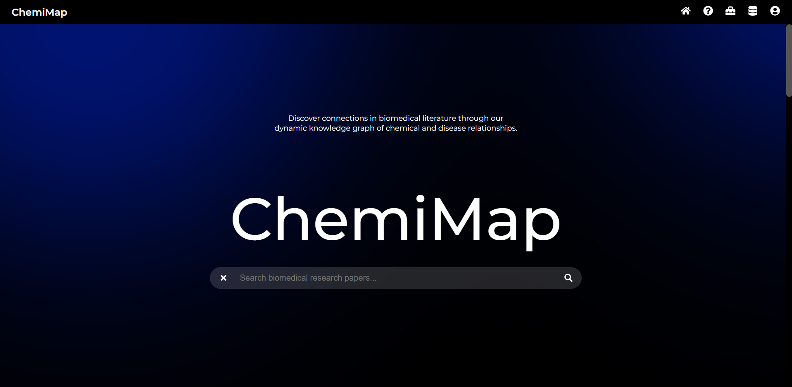
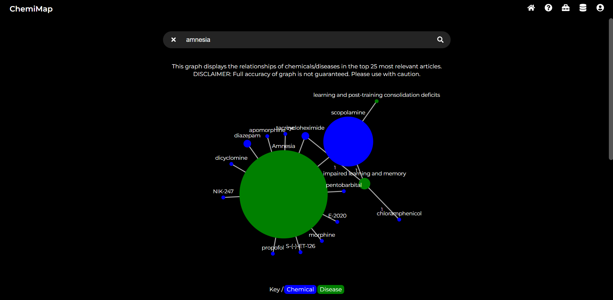
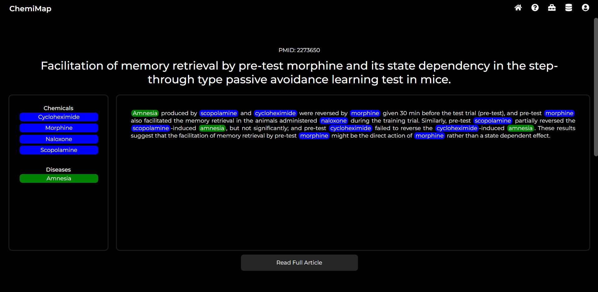

# ChemiMap
*This is ChemiMap's app repo. [Click here to go to ChemiMap's modelling repo.](https://github.com/NomitaChandra/ChemiMap)*

## Problem & Motivation

"Reading through hundreds of scientific papers is so fun and efficient!" said no one, ever. 

A researcher in the biochemical field typically spends hundreds of hours sifting through vast amount of scientific papers in search of information about a chemical, a disease, and their relationship. Exploring complex chemical-disease relationships is tough, and although there exist tools and databases for researchers, it's very difficult to visualize these relationships efficiently as they have to find and read through these articles in order to find the information that they are looking for. Researchers have to sift through fragmented and time-consuming material, and they often explore multiple hypotheses simultaneously, making it challenging to efficiently cross-reference large volumes of material. In the time spent reading, important connections get lost, and the process is slow and overwhelming. 

## Our Solution

Introducing ChemiMap, a chemical-disease relationship explorer that allows the user to quickly find relationships and relevant papers across vast amounts of literature. We designed a product to make research more efficient. ChemiMap uses state-of-the-art Named Entity Recognition (NER) and Relation Extraction (RE) models to find chemicals and diseases in papers and analyzes the most salient relationships between them. This information is presented in an easy-to-visualize interactive knowledge graph along with annotated abstracts of papers highlighting the entities, making research quicker and more efficient. With ChemiMap, we estimate an annual saving of $4 million in total with a user base of 1,000 researchers.

[See a quick demo of ChemiMap here.](https://github.com/NomitaChandra/ChemiMap)

Screenshots of the ChemiMapp app:




## Technical Details and Setup

### Tech Stack
- **Frontend**: React
- **Backend**: Python (Flask)
- **Database**: MongoDB (for data storage), Neo4j (for graph storage)
- **Search Engine**: Elasticsearch
- **Deployment**: AWS

### Prerequisites
Before you begin, ensure you have the following installed:
- Node.js (v14 or higher)
- Python (v3.6 or higher)

### Setup

#### 1. Clone the Repo
```bash
git clone https://github.com/annguyen1404/chemimap.git
cd chemimap
```

#### 2. Set Up the Frontend
```bash
# From the chemimap project folder, navigate to frontend folder
cd frontend

# Install dependencies
npm install
```

#### 3. Set Up the Backend
```bash
# From the chemimap project folder, navigate to the directory one level up
cd ..

# Create a virtual environment
python -m venv chemimap-venv

# Activate the virtual environment
# On Windows
chemimap-venv\Scripts\activate
# On macOS/Linux
source chemimap-venv/bin/activate

# Navigate into the chemimap project folder and to the backend folder
cd chemimap/backend

# Install backend dependencies
pip install -r requirements.txt

```

#### 4. Start MongoDB, Neo4j, and Elasticsearch
Ensure databases are running before starting the application. **Skip this step for now since databases aren't set up yet.**  

### Running the App

- Navigate to the backend folder and run:
    ```bash
    python chemimap.py
    ```

- In a new terminal window, navigate to the frontend folder and run:
    ```bash
    npm start
    ```